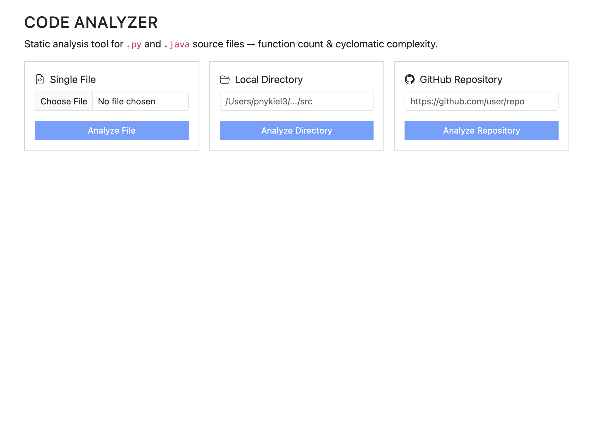
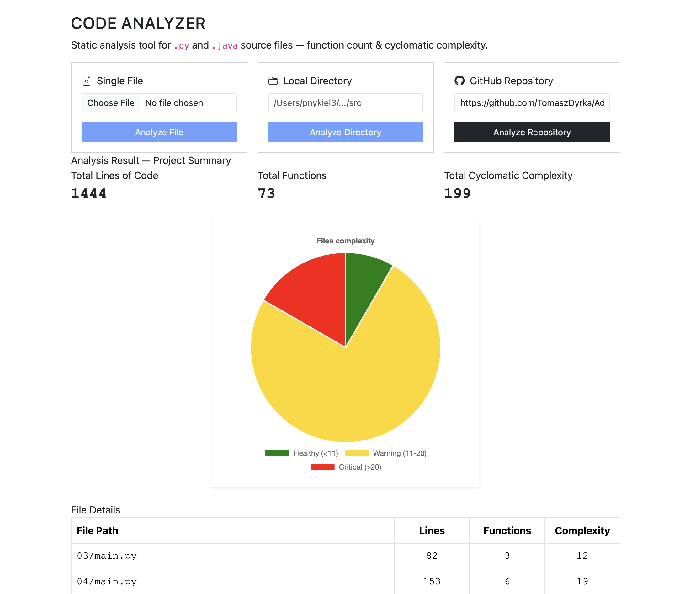

# Code Complexity Analyzer

A full-stack web application that performs **static code analysis** on Java and Python source files. It calculates key software metrics — including **cyclomatic complexity**, line count, and function count — and presents them through an interactive Angular dashboard with visual charts. Supports single file upload, local directory scanning, and **GitHub repository analysis** via URL.

---

## Demo


*Main dashboard — upload a file, scan a directory, or paste a GitHub repo URL to analyze.*


*Analysis results with per-file metrics and a pie chart breaking down complexity into Healthy, Warning, and Critical categories.*

---

## Features

- **Multiple input methods** — upload a single file, scan a local directory, or analyze a public GitHub repository by URL
- **Cyclomatic complexity calculation** — counts decision points (`if`, `for`, `while`, `switch`, `catch`, etc.) to quantify code complexity
- **Multi-language support** — built-in parsers for Java (via JavaParser AST) and Python (via Python's `ast` module)
- **Aggregated project metrics** — total lines of code, function count, and cumulative complexity across all files
- **Interactive visualization** — pie chart (Chart.js) categorizing files as Healthy (≤10), Warning (11–20), or Critical (>20)
- **REST API with Swagger docs** — fully documented OpenAPI endpoints available at `/swagger-ui.html`

---

## How It Works

### Cyclomatic Complexity

Cyclomatic complexity measures the number of **linearly independent paths** through a program's source code. The calculation starts at a baseline of **1** and increments for each decision point found in the code:

| Decision Point        | Java (AST Node)      | Python (AST Node)       |
|----------------------|----------------------|-------------------------|
| `if` / `elif`        | `IfStmt`             | `ast.If`                |
| `for` loop           | `ForStmt`, `ForEachStmt` | `ast.For`, `ast.AsyncFor` |
| `while` loop         | `WhileStmt`          | `ast.While`             |
| `do-while` loop      | `DoStmt`             | —                       |
| `catch` / `except`   | `CatchClause`        | `ast.ExceptHandler`     |
| `switch case`        | `SwitchEntry` (non-default) | —              |

### Backend Flow

```
Source Code → REST API → Language Detection → Parser (Java / Python) → Metrics DTO → JSON Response → Angular Frontend
```

1. The **controller** receives input (file upload, directory path, or GitHub URL)
2. For GitHub repos, the backend **clones the repository** using JGit into a temp directory
3. The **AnalysisService** selects the correct parser based on file extension (strategy pattern)
4. The parser **walks the AST**, counts decision points, functions, and lines
5. Results are returned as structured JSON to the frontend

---

## Tech Stack

### Backend
- **Java 21** with **Spring Boot 4**
- **JavaParser** — AST-based analysis for `.java` files
- **Python `ast` module** — invoked via subprocess for `.py` files
- **JGit** — programmatic Git clone for GitHub repository analysis
- **Lombok** — reduces boilerplate (DTOs, constructors)
- **SpringDoc OpenAPI** — auto-generated Swagger UI

### Frontend
- **Angular 21** (standalone components)
- **Chart.js** + **ng2-charts** — interactive pie chart visualization
- **RxJS** — reactive HTTP communication with the backend

---

## Project Structure

```
Code-Complexity-Analyzer/
├── src/                          # Spring Boot backend
│   └── main/java/com/pnykiel3/analyzer/
│       ├── controller/           # REST endpoints
│       ├── service/              # Business logic & directory scanning
│       ├── parser/               # Language-specific AST parsers
│       └── dto/                  # Data transfer objects
├── analyzer-frontend/            # Angular frontend
│   └── src/app/
│       ├── app.ts                # Main component
│       ├── app.html              # Template with forms & charts
│       └── services/api.ts       # HTTP service layer
├── pom.xml                       # Maven build config
├── screenshots/                  # Demo images
└── README.md
```

---

## Getting Started

### Prerequisites
- **Java 21+** and **Maven**
- **Node.js 18+** and **npm**
- **Python 3** (required for analyzing `.py` files)

### 1. Clone the repository

```bash
git clone https://github.com/pnykiel3/Code-Complexity-Analyzer.git
cd Code-Complexity-Analyzer
```

### 2. Start the backend

```bash
./mvnw spring-boot:run
```

The API will be available at `http://localhost:8080`. Swagger docs at `http://localhost:8080/swagger-ui.html`.

### 3. Start the frontend

```bash
cd analyzer-frontend
npm install
ng serve
```

### 4. Open the app

Navigate to `http://localhost:4200` in your browser.

---

## Example Output

### Single file analysis — `POST /api/analyze`

```json
{
  "linesCount": 47,
  "functionCount": 3,
  "cyclomaticComplexity": 8
}
```

### Directory / GitHub repo analysis — `GET /api/analyze-repo?url=...`

```json
{
  "totalLines": 312,
  "totalFunctions": 18,
  "totalComplexity": 34,
  "files": [
    {
      "filePath": "src/main/java/com/example/UserService.java",
      "fileMetrics": {
        "linesCount": 85,
        "functionCount": 6,
        "cyclomaticComplexity": 12
      }
    },
    {
      "filePath": "src/main/java/com/example/AuthController.java",
      "fileMetrics": {
        "linesCount": 62,
        "functionCount": 4,
        "cyclomaticComplexity": 7
      }
    }
  ]
}
```

---

## What I Learned

This project was a significant learning experience in building a real engineering tool from scratch:

- **Full-stack architecture** — designing a clean separation between an Angular SPA and a Spring Boot REST API
- **Abstract Syntax Tree (AST) parsing** — working with JavaParser and Python's `ast` module to analyze source code programmatically rather than relying on regex
- **REST API design** — structuring endpoints, handling file uploads with `MultipartFile`, and documenting APIs with OpenAPI/Swagger
- **Strategy pattern in practice** — implementing a `FunctionParser` interface so new language analyzers can be plugged in without modifying existing code
- **Working with Git programmatically** — using JGit to clone and scan remote repositories
- **Data visualization** — integrating Chart.js with Angular to present metrics in a meaningful, visual way
- **Software quality thinking** — understanding what cyclomatic complexity actually measures and why it matters in real codebases

---

## Future Improvements

- **Support for more languages** — JavaScript/TypeScript parser (Rhino dependency already included), C/C++, Go
- **Method-level complexity breakdown** — display per-function metrics instead of only per-file aggregates
- **Code smell detection** — identify patterns like long methods, deep nesting, and duplicated logic
- **Historical analysis** — track complexity changes across Git commits over time
- **Exportable reports** — generate PDF or CSV summaries of analysis results
- **Threshold configuration** — let users define custom Healthy/Warning/Critical boundaries

---

## About Me

I'm a Computer Science student with a strong interest in backend development and building tools that solve real problems. I enjoy digging into how software works under the hood — from parsing ASTs to designing clean APIs. I'm actively building projects, learning new technologies, and looking for opportunities to grow as a software engineer. This project was created to help me learn more about frontend development especially Angular.
**I am open to internship opportunities**
[LinkedIn](https://www.linkedin.com/in/pawelnykiel/)
<p.nykiel@icloud.com>
---

*Built with Java, Angular, and a genuine curiosity for code quality.*
